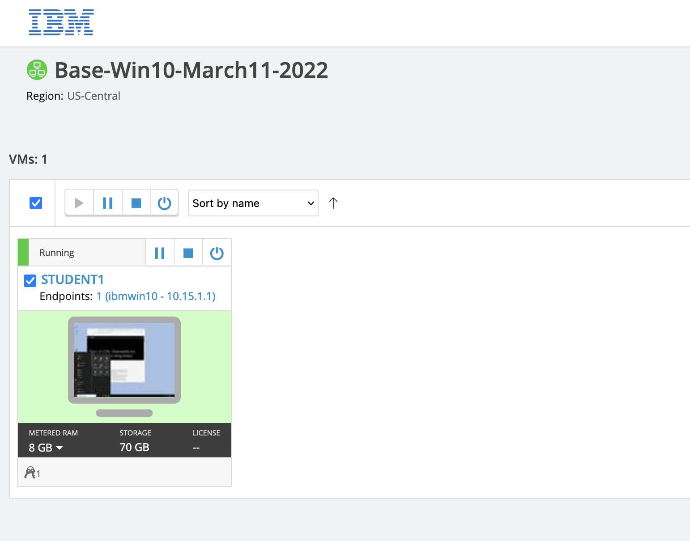
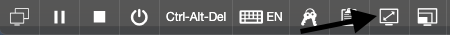
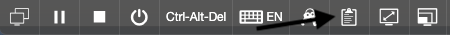
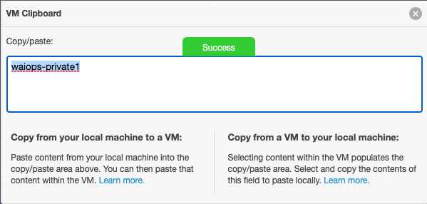

--- 
title: Think Lab 1201 - Using Instana to  achieve observability including the mainframe
description: Observability of a hybrid application using Instana including mainframe
---

## Introduction

This lab will introduce Instana and then illustrate how it can be used for an application which makes use of some mainframe components.

We have already instrumented the application for you and through the various lab exercises you will explore the capabillities of the combination of Instana.

1) In the first portion of the lab, students will get a good idea of the standard capabillities of Instana. If you are already familiar
with the Instana Observabillity solution you could skip to the second part which looks into the specific SystemZ capabillities.

2) The second part of the lab looks at how these same techniques can be applied on SystemZ components.

After completing the Login section, use the other links to go directly to one of the lab exercises.

When you first login to the Soleil virtual machines, a chrome browser will be open with multiple tabs.  The first tab will be this lab guide.  We recommend that you use
the lab guide within the virtual machine so that you can easily copy and past text into the terminal windows.

## Logging into the Environment

  Before beginning the exercises, take the following steps to login to the soleil environment and access the lab environment.

  After opening your browser and logging into the lab, you'll see an image of a computer.  It is named Student1. This 
  virtual machine is the Client machine from which you will access the different environments.

  

  If the background is green, it means the virtual machine is running.  If it is not running, click the start arrow to start the VM
  

  For more information on using the soleil environment, scroll towards the bottom of the page.

## Begin the Exercises

You are now ready to start performing the lab exercises.  After that, the sections can be done in any order.  For a new user of Instana, we recommend 
performing the **Explore Instana** section of the lab next.  If you are already familiar with Instana, you can select immediately the systemZ lab.

Select one of the lab exercises in the upper left corner or select one of the images below.

<Row>

<Column colLg={2} colMd={4} noGutterMdLeft>
<ArticleCard
    color="dark"
    subTitle="Explore Instana"
    title="Explore the Instana UI and Capabilities"
    href="/tutorials/Explore"
    actionIcon="arrowRight"
    >

</ArticleCard>
</Column>

<Column colLg={4} colMd={4} noGutterMdLeft>
<ArticleCard
    color="dark"
    subTitle="Instana and the mainframe"
    title="Learn How Instana Can Help you with hybrid applications that include Mainframe components"
    href="/tutorials/Instana on Z"
    actionIcon="arrowRight"
    >

</ArticleCard>
</Column>
</Row>

***

## Using the soleil environment

  There are a couple of things that are important to know when using the soleil environment.  At the top of the screen you will see a menu bar.  You'll notice a full screen icon as shown below. You'll have a much better experience with the lab if you use full screen.

  

  Another icon on the taskbar that is important is the clipboard icon

  

  The only way to paste content into the virtual machine is by using this icon.

  To copy text into the virtual machine, perform a copy as you normally would do on your laptop/desktop.  Then, click the clipboard icon. You will notice that there is text within the clipboard user interface

  

  This will make the text available within the virtual machine. Then, within the virtual machine, either type "Ctrl-V" or right-click and use your browser to paste the text into the virtual machine.

  To copy text from the virtual machine, do the process in reverse.  Copy the text inside the virtual machine.  Then, click the clipboard icon and you will notice that the text is visible on the screen.

  

  Whatever text you see on the VM clipboard, you'll be able to past within your laptop/desktop.

  Note:  The clipboard is a little bit unreliable.  You may need to attempt to copy/paste a couple of timess.  Also, try to avoid clicking in multiple places on the screen. Copy the content (Ctrl-C), click on the clipboard, then immediately paste to either your laptop or into the virtual machine.
