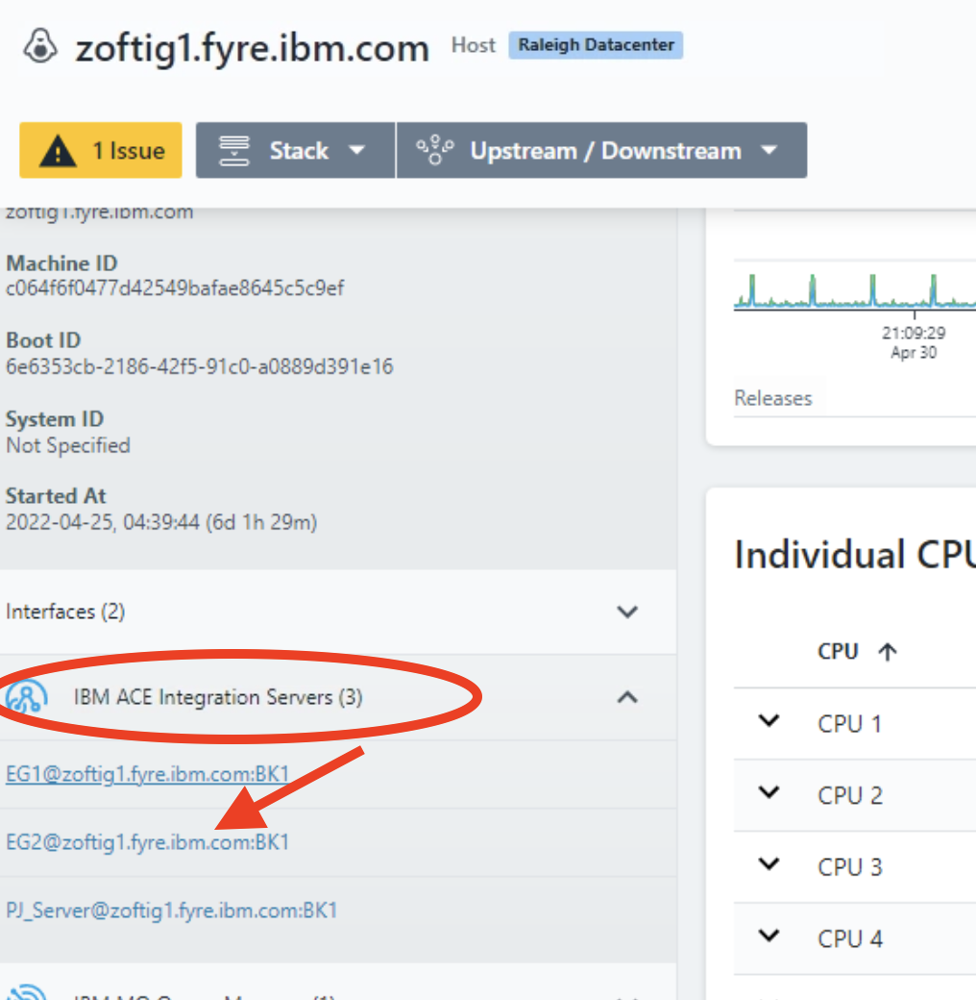
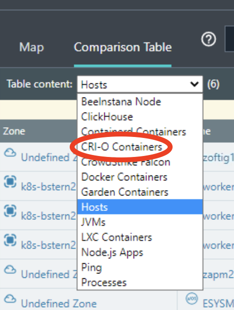
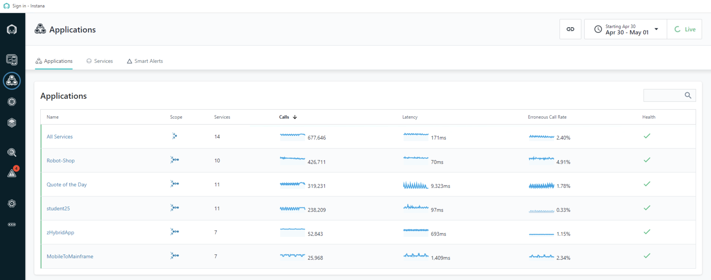
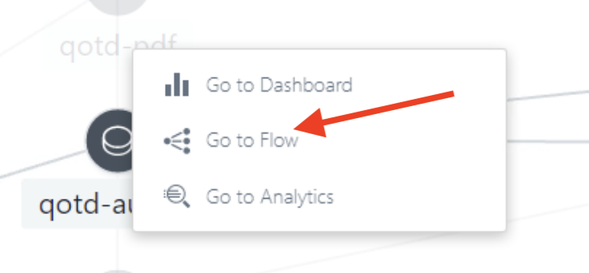
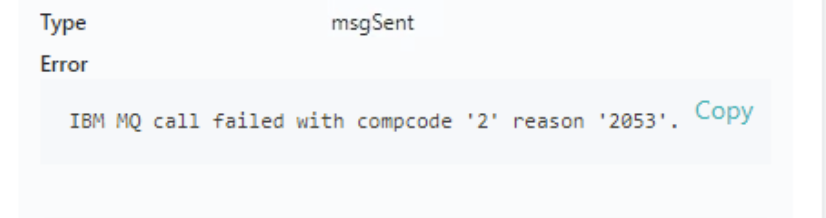
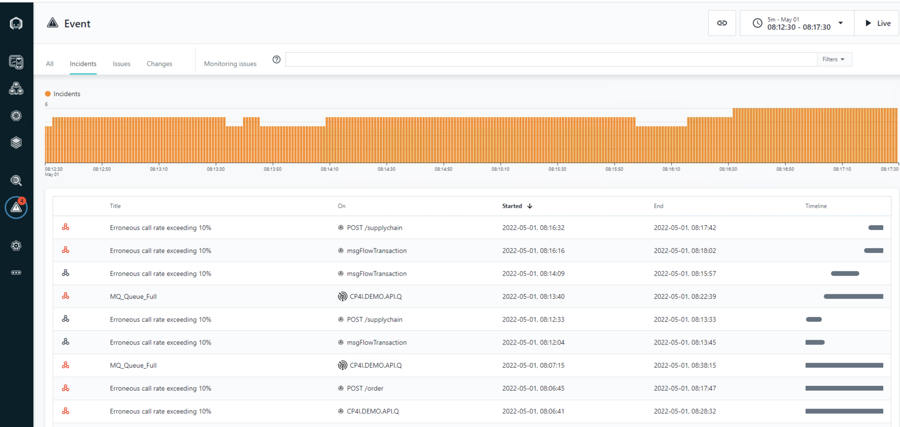

<AnchorLinks>
  <AnchorLink>1-1: Explore the Infrasture View</AnchorLink>
  <AnchorLink>1-2: Exploring Context Information</AnchorLink>
  <AnchorLink>1-3: Exploring the Application</AnchorLink>
  <AnchorLink>1-4: Working with Events and Incidents</AnchorLink>
  <AnchorLink>1-5: Summary</AnchorLink>
</AnchorLinks>

---

In this portion of the lab, you will explore some key Instana capabilities including monitoring of kubernetes, monitoring of applications, and monitoring of infrastructure.

## 1-1: Explore the Infrastructure View

Begin by logging into the Soleil lab environment. You should see a picture of a desktop system. Click on the system to login.
After logging in, launch the Chrome browser. The browser will open with 3 tabs

- The first tab is the lab guide.
- The 2nd tab is the Instana user interface
- The 3rd tab is a file that contains the username and password that you will use to login to Instana

Use the username and password from the 3rd tab to login to the Instana user interface.
You should now be looking at the home panel for Instana. The focus of these lab exercises will be on the monitoring information in the ‘Applications’ portion of the display.

Note the middle portion of the home panel lists applications currently being monitored by Instana.

In this environment a number of Instana agents have already been setup for you. So you will immediately be able to start exploring.
The first place we will look at is the Infrstructure View. Here you will discover a map of all the infrastructure that was discovered by the installed agents. Navigate to this view by **Clicking on the Infrastructure Item** in the left side menu.

You should now see a map as in the image below, showing the discovered infrastructure. Notice that it is organized in zones which is a mechanism to group the data from a number of agents together.

You can filter this map by entering queries in the top bar. For example **enter "Raleigh"** in the search bar to filter out one zone.
You get a view containing only the infrastructure which sits in the defined Raleigh Datacenter zone.

**Click on the Linux server host** in the picture, be sure to click on the outer containing box, not on one of the discovered services. You now see some details of the server.

To get more information on the server **click on the Open Dashboard** button. This gives you a dashboard with the various aspects which the agent discovered about this server

With the time selector on the right you can select which time frame of data to look at or use the option to see live data. When **clicking on Live** you start to see metrics in real time being refreshed at 1 sec resolution

With the drop down you can select historical data to see how things have evolved over time.

You can now also drill down in the objects which were discovered by the agent on this machine. **Click on one of the ACE Integration servers** which you see in the entities list on the machine overview. Best one to look at ist the EG2 instance as it is the most used one in this sample setup.

You now get some details on this object running on the machine. You see for example that it is a JVM, you can analyze the memory consumption and if you scroll down the message flows it is running.

You can also see how this messaging object fits into a flow. **Click on the flow tab**

You now see how this messagig object is being used.

Another way to look at infrastructure is to use the comparison tables. To do so click on the infrastructure icon in the left tool.

Now click on the Comparison Table tab at the top left of the screen 

This shows you the comparison table. By default the subject of the table is the Hosts and the metric shown is the CPU usage

You can select other topics in the Table content drop down.

**Select "CRI-O Containers"** This will show you a similar table but now on the CPU usage of the different containers in our environment.

---

## 1-2: Exploring Context Information

The previous steps showed you a fairly traditional approach in monitoring. You look at metrics starting from the infrastructure level. This can still be handy, but in todays complex world there is a number of more interesting ways of looking at metrics. Instana offers you for example to look at the data in various context beyond the infrastructure. For example in which application(s) is this service used and how does it impact them.
**click on the Infrastructure icon** in the left menu bar.

You now return back to the full Infrastructure map view.

**Type k8s-bstern2** into the search bar

**Click on the k8s-bstern2 zone** which contains a kubernetes cluster.

**Click on Open Dashboard**

You see now an overview of this cluster and the various nodes it contains.

This is due to the fact that this zone is setup to filter the nodes belonging to this Kubernetes cluster. You can now also drill down in this Kubernetes context, by **clicking on the Stack drop down**. The Kubernetes context shows you information which is relevant from a viewpoint of the operator managing this cluster. He can now see which PODs are running onto it.

From here you can also switch to the Infrastructure context where you could see information on the containers that are running.
Even more interesting from a today viewpoint is that you can select one of the worker nodes and move up to the application context level.
**Click on the first worker node**

Now back from the stack drop down, **click on application view** This shows you which applications are running in this context.

---

## 1-3: Exploring the application:

In a modern digital business world you will typically want to start out from the application viewpoint.
**Application Perspectives** allow you to group together a number of different services and endpoints into dashboard that shows the health and performance of a business application.
In this section, we use the **Application Persective** for the **Quote of the Day** application that was defined in this setup.

On the left hand navigation, select **"Applications"**. You will see a screen open up that contains a list of all applications that are defined in the environment.

**Select the Quote of the Day application**

This opens up the dashboard for the application.

This view will give you immediately a good view of what the state of this application is. You see golden signals like load on the application, latency, calls resulting in an error and the general resource consumption. This allows for a very quick decision if the application is doing OK or if there are some potential issues. We will see that using Instana we can also get a better idea of the topology of this application and what are the dependencies between the various components.

At this moment you have no clue what this application is about. **Click on the dependencies tab** to get some insight in what is going on in this applicaiton.

These topologies are build in a dynamic way based on detection of calls flowing between components. This allows Instana to cope with the high volatility in todays workloads, where the static definition of a topology no longer keeps up.
With this dependency map you can get a good insight in the application components and there relation, even if you were never involved in the internals of this application. In this case we see web frontend service depending on a bunch of other services. If you want to see more detail
about a particular service, you can just hover over it.
For example **hover over the qotd-author** service.

By **clicking on the service** you get access to more details. You can jump to the dashboard for this specific service, you can analyze the call stack details or you can get a look at the call flow.
Select **Go to flow**

This shows a view where you clearly see which component calls what other component.

This view can be used to get some insight in the performance of each of the components. Developers can use this to figure out performance bottle necks.
You can for example see a latency report and see the actual call flows. Do this by selecting Latency and clicking on the top icon which activated the call visualisation.

In this case we see for example that the qotd-image service is responsible for the bulk of the latency on the qotd-author service.

---

## 1-4: Working with Events and Incidents

Now move back to the Qute of the Day application Dashboard.

What we could already have noticed in the previous steps is that there is a quite large number of erronuous calls being shown on this dashboard.

 

You can now get a better insight in what is going on by clicking on one of the red bars and then selecting View in Analyze.

This shows a filtering of the various calls that cause errors in the context of the quote of the day application in the selected time frame.

The drill down allows me now to perform a root cause analysis. **Click on the QM1 service** You will notice that this shows some detail on the underlying behaviour.

Notice that this corresponds to some PUT calls towards an MQ instance. If you **click on the PUT call** you get a view of the detailed stack trace of this call

**Scroll down on this screen to see a full detailed stack trace**

Selecting the bottom of the stack trace (erronuous put on the queue manager) you will see the actual error message.

Looking at the detail of the message we note that there is an actual MQ error message which indicates that this queue is full.

In this way we quite drilled down to the root cause of this problem, which is nice, but Instana will help you even more. If we take a good look at the menu bar on the left of the screen we notice a red indicator on the events icon.

Click on the Events which opens the Event dashboard page

You notice the MQ queue full event. If you click on that one you immediately see the details of the problem that is at the basis of our previously detected errounous call rate.

## 1-5: Summary

In this exercise you have explored some of the key capabilities within Instana. You explored kubernetes monitoring. You defined an Application Perspective. And you
explored the application monitoring details.

To continue the mainframe portion of the lab, select the lab exercises in the upper left corner.
