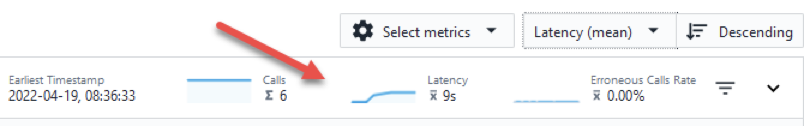

<AnchorLinks>
  <AnchorLink>2-1: Getting Started</AnchorLink>
  <AnchorLink>2-2: Analyzing zHybridApp</AnchorLink>
  <AnchorLink>2-3: Problem Analysis Using IBM Instana for z/OS</AnchorLink>
  <AnchorLink>2-4: Understanding Dependencies Using IBM Instana for z/OS</AnchorLink>
  <AnchorLink>2-5: Summary</AnchorLink>
</AnchorLinks>

***

IBM Observability by Instana APM for z/OS (Instana for z/OS) provides transaction tracing information and resource monitoring metrics from z/OS subsystems to Instana, IBM’s APM/Observability solution.  Instana for z/OS can be implemented on z/OS purely as a feed to Instana for transaction tracing data of key z/OS subsystems, or may be combined with existing OMEGAMON z/OS system monitoring to provide additional resource monitoring and metrics for z/OS subsystems. 
The objective of this set of lab exercises is to introduce the capabilities of IBM Instana for z/OS, and to demonstrate the ability of Instana for z/OS to highlight and identify z/OS transaction issues in an end to end manner.  
The lab environment is running in a live z/OS environment and is passing information to a live Instana server. 

## 2-1: Getting Started

Begin by logging into the Soleil lab environment.  You should see a picture of a desktop system.  Click on the system to login.
After logging in, launch the Chrome browser. The browser will open with 3 tabs

  - The first tab is the lab guide.  
  - The 2nd tab is the Instana user interface
  - The 3rd tab is a file that contains the username and password that you will use to login to Instana

Use the username and password from the 3rd tab to login to the Instana user interface.
You should now be looking at the home panel for Instana.  The focus of these lab exercises will be on the monitoring information in the ‘Applications’ portion of the display.

Note the middle portion of the home panel lists applications currently being monitored by Instana, including applications with z/OS components.

To see all the Applications being observed   Click on ‘All Applications’ 

You should now be looking at the Applications panel that shows application performance and availability across the various applications in the lab environment. This panel shows a summary by application name, with number of calls and call latency.  Note that you may sort this display.
Click twice to the right of Name to sort the display in descending order

You should now be looking at the Applications display sorted in descending order by Application Name.
The application of interest for this lab section is zHybridApp.
Click on zHybridApp to drill down for more detail on the sample z/OS application.

You should now be looking at an overview display for the zHybridApp application.  This display provides a wealth of information about the zHybridApp application, including call counts, processing time, call counts by status and call latency.   

Note that you may look at information about zHybridApp for various time frames.  For purposes of this exercise it is recommended you look at information for the Last Hour.

Click in the upper right area of the display and select ‘Last Hour’ if it has not already been specified

Note that in the bottom center portion of the display you will see the ‘Top Services’ portion of the display.  In z/OS context the Top Services will include key mainframe resources, such as CICS regions, Db2 on z/OS databases and z/OS Connect regions.

Click on ‘View All Services’  under Top Services

You should now be looking at a display that shows the various Services, as identified by Instana, that make up the zHybridApp sample application. 

In the Services display you will see information on the various resources that make up the zHybridApp.  Some of these Services will be off the mainframe, such as zapm2-nginx and SimpleProxy.  In addition, you will see various z/OS specific Services, such as CICS, Db2 and z/OS Connect. 
CICS is one of the transaction managers used commonly on z/OS.  In the zHybrid application you see three CICS regions, CICSTIVA, CICSTIVB and CICSAOR1.  Db2 is part of the zHybridApp and the display above you see a Db2 subsystem called DSNA.  You will also see a reference to z/OS Connect region, zceebill. z/OS Connect is an API enablement capability for z/OS.  In the above example z/OS Connect functions as an API enablement interface to CICS region CICSAOR1.
In the Services display you will see a list of the relevant services for zHybridApp, the type of Service (CICS, database, z/OS Connect and more), the call counts for each of the services, and latency information for each Service.

***

## 2-2: Analyzing zHybridApp

From the Services display you may drill down to see more information on how these Services are being utilized within zHybridApp. 
Click on CICS Region CICSTIVA    

You should now be looking at the summary display for CICS CICSTIVA.  This display will show call counts, rates, processing time and latency.  Under the Top Endpoints you will see the transaction being executed within CICSTVA called CPIH.

 

The zHybridApp originates on the HTTP tier.  The SimpleProxy Tomcat application issues Web Services calls to CICS region CICSTIVA.  CICSTIVA invokes transaction CPIH in the CICSTIVA region running on z/OS. CPIH initiates the business transaction LGICUS01 which accesses VSAM files, performs a CICS MRO connection to CICS region CICSTIVB to access another VSAM file.  LGICUS01 also makes calls to Db2 subsystem DSNA.
From here you may drill down to see call detail and get a better understanding of the flow of the application.
Click on ‘Analyze Calls’ in the upper left area of the display

 

You should now be looking at a display that shows call counts, erroneous call counts and call latency.  Towards the bototm of the display you will calls by call group.  In this application component you see one transaction, CPIH (a standard CICS Pipeline Handler transaction).

 

From here you may drill down to see call detail.
Click on cics/CPIH   to see a list of individual requests.

You now see the display expand to show individual transactions listed towards the bottom of the display.  This display will show the transaction code, the Service name and the latency time for the transactions on the right.

Click on cics/CPIH   to see detail for an individual request

You should now be looking at the detail for a selected transaction.

Scroll the display to see the call information summarized towards the bottom.  This portion of the display will show the sequence of calls that make up the chosen application flow.

In the Calls display you can see that the call originated in a Service called zapm2-nginx, then went through a proxy service called SimpleProxy.  The call next went to the mainframe (esysmvs1.ztec.dmz), and then ultimately was sent to CICS region CICSTIVA.  You can see the relative latency times for each step on the way.

Note that on the right portion of the display you see information about the CICS transaction.  This includes the call type, and the CICS Task Number.  The Task Number is an important item of information to identify the specific CICS task that executed the transaction.

Note that underneath the cics/CPIH call you see other call information, including a call to read a VSAM file, a call to a Db2 database (DSNA), and a CSMI transaction call to another CICS Region (CICSTIVB).
You may click on other items in the call sequence for more information
Click on VSAM File

You will see that this portion of the transaction flow is a call to a VSAM file allocated to the CICS Region.
Click on CSMI
You should now see detailed information about the call being executed in the second CICS Region, CICSTIVB. Note you see the CICS Region name and the CICS Task Number.

Feel free to explore other items in the transaction call sequence.
There is another portion of the zHybridApp you may examine in more detail.  This application flow is a z/OS Connect Enterprise Edition (ZCEE) application.  The application originates again in the HTTP tier, issues REST API calls to a ZCEE instance running on z/OS called ZCEEBILL, ZCEE invokes a CICS transaction in CICS region CICSAOR1, and CICSAOR1 reads a VSAM file as part of the CICS transaction execution.
Click on the Applications icon on the left of the display
Click on the Name header and sort descending
Click on zHybridApp

You should again be looking at the Summary display for zHybridApp you were looking at earlier.
Click on the Services tab
You should again be looking at the Services display for zHybridApp you were looking at earlier.
Click on zceebill   this is the z/OS Connect instance running on the mainframe
You are now looking at the Summary view for the z/OS Connect Service.  This shows call counts, latency information and the Top Endpoints referenced by the Service.

Click on Analyze Calls

You should now be looking at the call overview for the z/OS Connect Service.

This display shows call counts, erroneous calls (if any), call latency and Endpoint Names referenced by the application.  In this example z/OS Connect is invoking an endpoint called catalog.
Click on catalog under Endpoint Name

You will see the display expand to show individual transaction executions and the latency time for each transaction on the right of the display.
Click on GET/inquireSingle

Scroll the display as you did earlier to see the Call detail
You should now see the detail for the z/OS Connect call.  This includes request path, API Name and Request ID, as shown on the right.  This also will show the call sequence in the middle.

Click on CSMI

You should now be able to see the CICS task detail for the underlying CICS transaction invoked by z/OS Connect.

This display will show the CICS Region Name and the CICS Task Number for the transaction request.  Note that the application will also make a call to a VSAM file, similar to the other example application flow.

### 2-3: Problem Analysis Using IBM Instana for z/OS
IBM Instana for z/OS provides information that allows the user to identify and isolate transaction issues. This is whether the issue is at the http server tier, at another distributed tier, or at the z/OS, CICS, Db2, IMS, z/OS Connect or MQ on z/OS tier.
As shown in the prior section, Instana provides ongoing information on transaction performance/latency and breaks down that information by the various tiers of the application.  This section of the lab will outline how to view and analyze application performance.
A good place to begin with problem analysis using Instana for z/OS is the Overview display for zHybridApp. 

Click on the Applications icon on the left of the display
Click on the Name header and sort descending
Click on zHybridApp

You should again be looking at the Summary display for zHybridApp you were looking at earlier.

The Summary display for zHybridApp shows an overview of call counts, erroneous call counts, processing time and latency time plotted over a time interval.  The time interval is customizable based on the options button on the top right of the display.
Note – it is recommended for this exercise to start with a time interval of One Hour
You should note the latency plot chart for zHybridApp shows an occasional increase in latency time for the application.  You may also notice an increase in Processing time in the same time interval.

Position the cursor over the plot line for Latency
Note how you will see a flyover popup that shows the latency time and a percentile.

Click on the plot chart line   (where the latency is high)
Click on ‘Zoom to time range’
  

You should now be looking at the Summary display for the selected time range with the high latency issue.  Note how the time range for the display has changed in the upper right.

Click on Analyze calls

You should now be in an Analytics display for zHybridApp.

The bottom portion of the display by default shows Service Name listed by Call Count descending.  To focus on high latency, sort the display by latency.
**Click on the box to the right of ‘Select metrics’**

  **Click on Latency**

You should now see a display listing Service Names for zHybridApp sorted by latency time in a descending order.
**Click on the line with the highest latency time**

You should now see a listing of transactions that employ this Service for the time interval in question.  If you look to the right you should see some transactions with high latency time.

Click on one of the high latency calls
You should now be looking at detailed information for the chosen call, including overall latency time and the various subcalls.

Scroll the display down
You should now be looking at the subcall detail for the selected transaction.

Notice that in the example transaction the vast majority of latency time is in the database, in this example a Db2 subsystem on z/OS called DSNA.  From here you can determine that the cause of the latency is an issue within the database.

### 2-4: Understanding Dependencies Using IBM Instana for z/OS

IBM Instana for z/OS provides information that shows the interrelationships of the Services that compose an application, such as zHybridApp.  This section will demonstrate an example.
**Click on the Applications icon on the left of the display**
**Click on the Name header and sort descending**
**Click on zHybridApp**

You should again be looking at the Summary display for zHybridApp you were looking at earlier.
**Verify that your time range in the upper right corner is for the Last Hour**
You should now be in the Summary display for zHybridApp.
**Click on the Dependencies tab**

You should now be looking at a Dependencies view, similar to the following.

The Dependencies view shows the interrelationships of the Services that compose an application, such as zHybridApp in this example.  From here you may drill down to see more information on specific component flows of the zHybridApp.  
For example you may drill down on the z/OS Connect portion of the application.
**Click on zceebill in the graphic**
**Click on ‘Go to flow’**

You should now be looking at another graphic view that focuses on the flow of a portion of the zHybridApp, in this example the z/OS Connect portion.  Note that the call orginates from a request coming from zapm2-nginx.  The API call then goes to a z/OS Connect task named zceebill. z/OS Connect then issues a transaction request to a CICS Region, CICSAOR1.  CICSAOR1 will process the transaction and send back the requested information.
Note that in the display there may be a green + sign next to CICSAOR1.
**Click on the Green + sign**

You should now be looking at additional information on the application flow.  In the example below you see an additional icon that shows ‘Unspecified’.  Unspecified is a reference to a VSAM file access by CICS.

Note that each icon shows call counts, latency time and error percentage for the selected application flow.
**Click on the icon to the left to see animated flows.**

From the dependencies display you may want to drill down to see call detail for the application flow.
**Click on ‘Analyze calls’**

You are now looking at the Analytics display.  Note on this display you see call counts and latency information for the transaction requests.  
Note that in the Groups section of the display you will see one endpoint name, in this example it is catalog.

**Click on catalog in the Endpoint name section to see calls**

You should now see a listing of the individual transaction calls to the catalog API.
You may click on a selected call to see more detail, as has been demonstrated in prior sections of this document.
**Thank you!  This concludes the Instana for z/OS portion of the lab exercise.**

## 2-5: Summary

In this exercise you have explored some of the key capabilities within Instana.  You explored kubernetes monitoring.  You defined an Application Perspective. And you
explored the application monitoring details.

